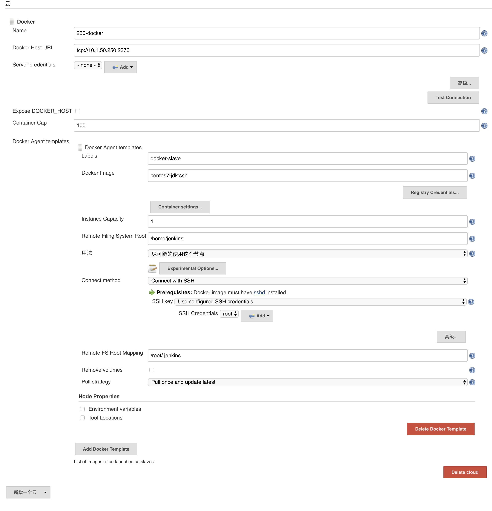

```
yum -y install docker
docker pull centos
docker run -it -p 2222:22 --name centos centos  /usr/sbin/init 
#bug 不加/usr/sbin/init systemctrl启动服务报错

docker exec -it centos bash
yum -y install openssh-server java
systemctl enable sshd
systemctl start sshd
echo 123456 | passwd
exit

docker commit -m 'install java-1.8.0-openjdk openssh' -a 'Docker Newbee' 2a27e90453f0  centos7-jdk:ssh

vi /etc/docker/daemon.json
{
  "debug": true,
  "hosts": ["tcp://10.1.50.250:2376","unix:///var/run/docker/libcontainerd/docker-containerd.sock"]
}

systemctl restart docker

curl -X GET http://10.1.50.250:2376/images/json

export DOCKER_HOST="tcp://10.1.50.250:2376"
docker ps

or

docker -H 10.1.50.250:2376 ps

jenkins 安装docker plugin插件
配置


工程构建的时候选择lable
 
agent也可以通过Kubernetes管理，有插件
```
