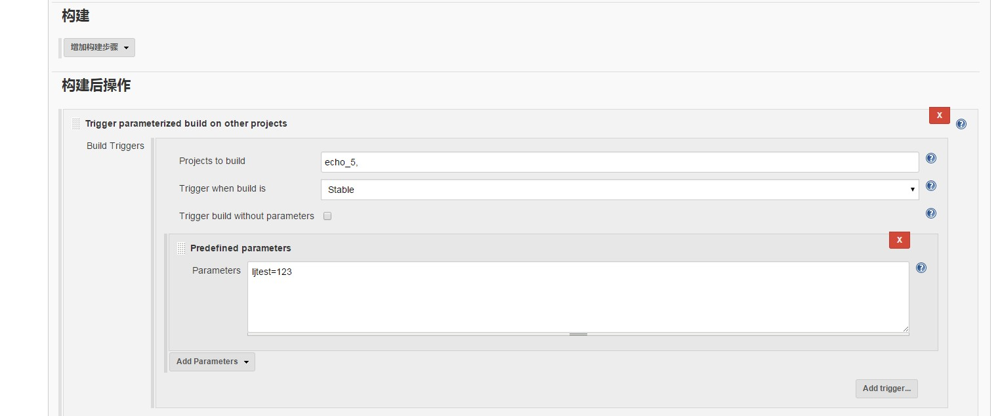
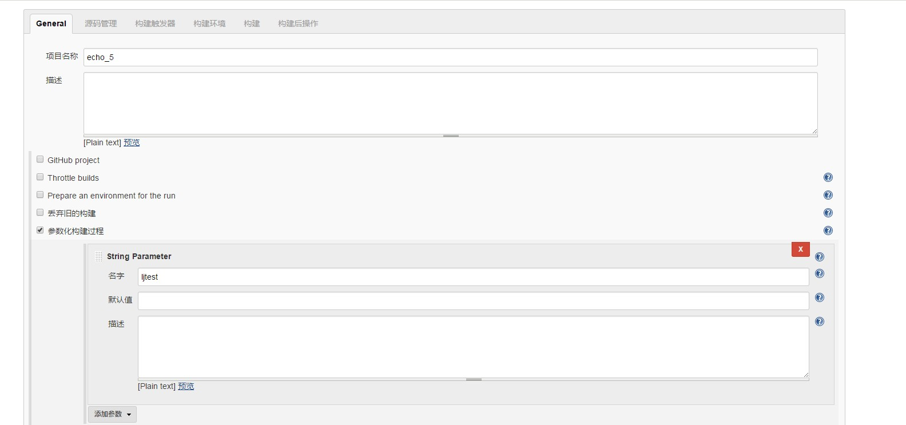
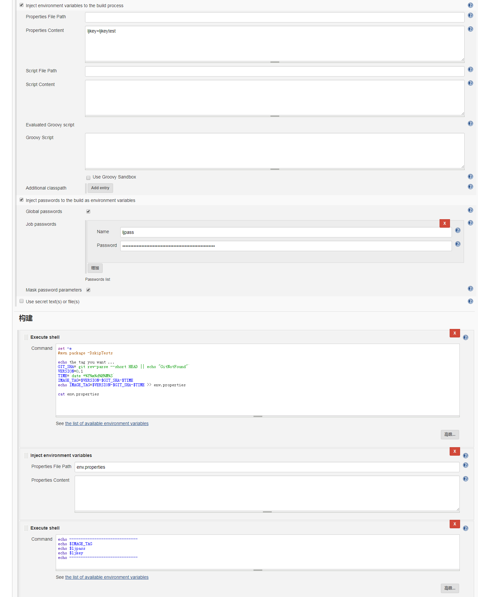
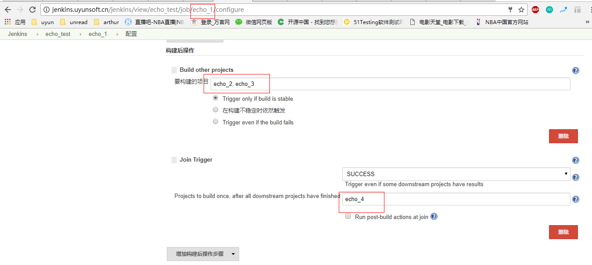
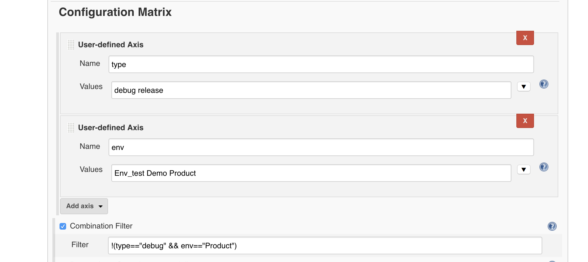

1.
使用slave时可能会导致一些命令找不到

> 注意可能在linux slave上使用了bashrc而非profile导致的

2. 重启jenkins

访问 http://xxxxxxxx:8080/restart 

3.插件列表

https://wiki.jenkins-ci.org/display/JENKINS/Plugins

4.
Parameterized Trigger Plugin:
参数传递



5.
Environment Injector Plugin
Inject environment variables to the build process


6.
thinbackup backup plugin:备份插件
```
thinBackup plugin可以自动备份全局的和job的指定配置文件（不包括archive和workspace）。
backup plugin可以备份JENKINS_HOME，可以选择是否备份workspace、builds history、maven atifacts archives、fingerprints等。
thinBackup plugin和backup plugin不同：
backup plugin只能手动触发备份，thinBackup plugin可以定期自动备份。
backup plugin可以备份JENKINS_HOME，可以选择哪些内容是否需要备份（如workspace、builds history等）， thinBackup plugin只备份最重要的信息（全局的和job的指定配置文件）
```
7.
* Hudson Post build task:增加构建后的操作
* build timeout plugin:构建超时设置
* Build Timestamp Plugin:往console log中增加时间戳

8.
Join plugin
等下游job echo_2和echo_3完成之后才会触发echo_4


9.
Multiple SCMs plugin

10.
高级项目选项：

* 安静期：一个任务计划中的构建在开始前需要读取开始前的配置信息；不选中则使用系统默认值
* 重复次数：若从版本库签除代码失败，则Jenkins会按指定次数重试后再放弃
* 该项目的上游项目正在构建时阻止该项目构建：当项目有依赖关系时，需要勾选
* 该项目的下游项目正在构建时阻止该项目构建：
* 使用自定义的工作空间：每个Jenkins任务都会有唯一一个工作空间目录，下载源代码，构建的整个过程都是在这个工作空间中
* 显示名称：仅供Jenkins Web页面显示

11. 远程参数化构建
> http://x.x.x.x:8080/jenkins/job/echo_1/buildWithParameters?token=ljtest123&ljtest=Value&ljtest2=true
> http://x.x.x.x:8080/jenkins/job/echo_1/build?token=ljtest123

12. MultiBranch Pipeline
> 对每个分支建立同样job

```
1.基于主干的开发
前面已经介绍过了《持续交付》更倾向使用基于主干的开发模式，所有项目成员把代码都提交到主干上，提交后自动触发持续集成进行验证和快速反馈，通过频繁的集成和验证，在保证质量的同时提升效率。主干开发模式非常强调代码提交习惯，包括频繁、有规律的代码提交（比如每人每天提交一次），而提交前需要进行充分的本地验证和预测试，以保证提交质量，降低污染主干代码的概率。

优点：
相比于分支开发，主干开发模式有很多优势。首先是代码提交到主干，可以做到真正的持续集成，在冲突形成的早期发现和解决问题，避免后期的”合并地狱”，这样的整体成本才是最低的。
对持续集成来说，具体实施也将会变的非常简单，只需要维护一条pipeline交付流水线，通过git的hook机制，当有新代码提交的时候就会触发pipeline的执行并反馈结果，如果有问题代码提交人员必须要实时去解决。
难点：
主干开发模式有很多优势，但具体实施过程中会发现，当一个项目开发者多了以后，如果没有强力的制度约束和相关意识支撑，推动起来会碰到不少的困难，比如：

主干上功能开发完成时间有先有后，如果遇到有未完成的功能但又需要发布时，就需要一种方法屏蔽掉未完成功能，才能进行安全的发布
主干上功能开发完成后，如果需要比较长的时间进行验收测试，那么此时为了确保发布功能的稳定性且所有功能是经过验证的，可能会限制新功能的提交，有的团队采用的封版、冻结主干的做法就是这种情况，这样的确会影响开发效率
如果修改的功能非常复杂，或者要进行架构上的大范围重构，以上问题就更加明显和难以解决了
如果团队规模比较大，同时工作在主干上的开发人员比较多，那么冲突的概率会比较大，持续集成的失败率可能比较高
这些问题并不是无解，比如通过功能拆解合理规划需求进行增量开发；通过配置隐藏未完成功能；以微服务的思想对大的架构进行拆分组件，每个组件独立开发和部署等。前提是我们的系统要有良好的架构设计，以及我们的开发者要有良好编码协作习惯。

这正是很多团队经常默认使用的模式，具体表现为接到需求后拉出分支，后面的开发都在分支上提交，每个分支生命周期较长，并且可能有多个并行分支，直到快要上线时或者上线后才合并到主干。
优点：
多个功能可以完全并行开发，互不干扰。还可以按每个功能特性拉出分支，那么每次提交都是完整的功能特性，分支划分明确、版本控制的记录也会比较清晰易懂。并且由于不同需求的开发进度不同，可以选择某个先开发完成的功能特性进行合并、发布，而不会被其它分支上未完成的功能特性阻塞。
缺点：
引用电影《无间道》中的一句话，“出来混，总有一天要还的”，因为虽然使用分支暂时隔离了不同功能的代码，但系统的多个功能或者多个组成部分最终还是要集成在一起工作的。如果不同分支代码之间有交互，合并时可能会有大量冲突需要解决。
在实际项目中，进行代码合并时通常很容易出错，解决冲突也非常耗时，特别是到代码合并时基本都已经到了项目后期，经常出现合并错误甚至遗漏合并的问题，对于QA来说，每个分支通过测试后，合并代码以后又需要系统的重新测试一次，工作量巨大不说还很容易导致一些合并造成的bug遗漏到线上，经历过的同学都曾体会过这种方式的痛苦。
对于持续交付来说，每条分支我们都需要搭建一条完整的pipeline与之对应，这意味着需要更多的部署环境和更多的重复测试，在合并代码后所有的过程还需要重新来一遍以避免各种代码合并错误。
```
13. Jenkins Multi-configuration Project


14. jenkins 维护<br>
disk uage插件: 相关选项在系统管理和系统配置

15. 构建进阶插件
Dependency Graph Viewer Plugin<br>
Lockable Resources plugin<br>
promoted builds plugin<br>

