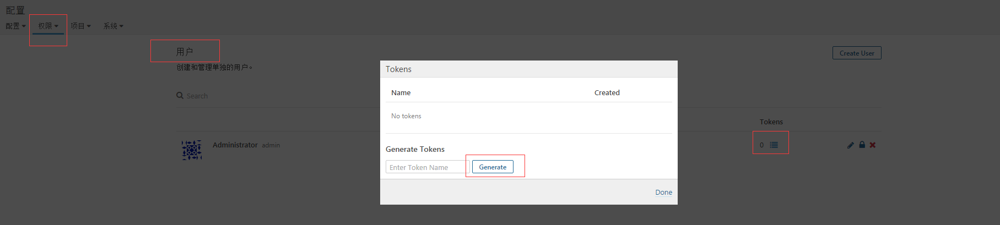

```
wget http://apache.opencas.org/tomcat/tomcat-9/v9.0.0.M4/bin/apache-tomcat-9.0.0.M4.zip
unzip apache-tomcat-9.0.0.M4.zip
cd apache-tomcat-9.0.0.M4/webapps/
cd apache-tomcat-9.0.0.M4/bin
wget http://ftp.tsukuba.wide.ad.jp/software/jenkins/war/1.654/jenkins.war
cd /root/apache-tomcat-9.0.0.M4/bin
chmod +x catalina.sh
sh startup.sh 

#sonar 和nexus 用ljtest用户安装
http://10.1.240.124:8080/jenkins/

#也可用sonar自带的数据库
yum -y install mysql mysql-server
wget https://sonarsource.bintray.com/Distribution/sonarqube/sonarqube-5.4.zip
/etc/init.d/mysqld start
mysql_secure_installation

mysql -uroot -p123456
CREATE DATABASE sonar CHARACTER SET utf8 COLLATE utf8_general_ci; 
CREATE USER 'sonar' IDENTIFIED BY 'sonar';
GRANT ALL ON sonar.* TO 'sonar'@'%' IDENTIFIED BY 'sonar';
GRANT ALL ON sonar.* TO 'sonar'@'localhost' IDENTIFIED BY 'sonar';
FLUSH PRIVILEGES;

vi /home/ljtest/sonarqube-5.4/conf/
sonar.jdbc.username:                       sonar
sonar.jdbc.password:                       sonar
sonar.jdbc.url:                            jdbc:mysql://localhost:3306/sonar?useUnicode=true&characterEncoding=utf8&rewriteBatchedStatements=true
# Optional properties
sonar.jdbc.driverClassName:                com.mysql.jdbc.Driver 

cd /home/ljtest/sonarqube-5.4/bin/linux-x86-64
sh sonar.sh start

http://10.1.240admin
tip：
最新版默认帐号admin/admin
配置选项有点不一样，直接看配置文件就行

wget https://sonatype-download.global.ssl.fastly.net/nexus/oss/nexus-2.12.1-01-bundle.zip
/home/ljtest/nexus-2.12.1-01/bin
nexus start
http://10.1.240.124:8081/nexus/
启动相当慢，等
默认账号：admin/admin123  deployment/deployment123
可以建用户实现权限管理

jenkins配置:
SonarQube Plugin	
JaCoCo plugin
Sonargraph Plugin <==> SonarQube Scanner for Jenkins
系统管理–》Global Tool Configuration 

sonar token生成
菜单–》配置–》权限–》用户–》TOKENS–》Generate 生成token，将生成token添加到此处，完成添加。
 "sonar"
Analysis properties:
sonar.projectKey=$JOB_NAME
sonar.projectName=$JOB_NAME
sonar.projectVersion=$BUILD_NUMBER
sonar.projectBaseDir=$WORKSPACE
sonar.sources=src
sonar.java.binaries=target/classes
sonar.language=java
sonar.sourceEncoding=UTF-8
sonar.java.coveragePlugin=jacoco
sonar.jacoco.reportPath=build/jacoco.exec
sonar.junit.reportsPath=junit
sonar.scm.disabled=true 


以下配置没有用到
sonar.java.libraries=lib,/home/soft/sonar-runner-2.4/lib
```
